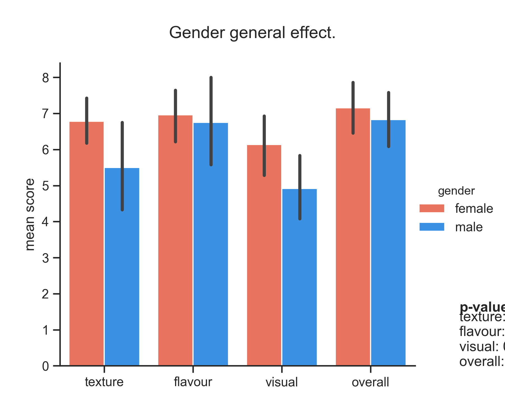
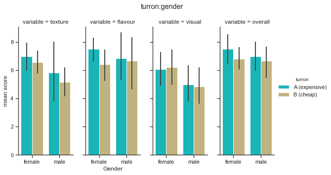
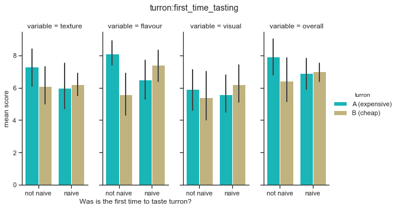
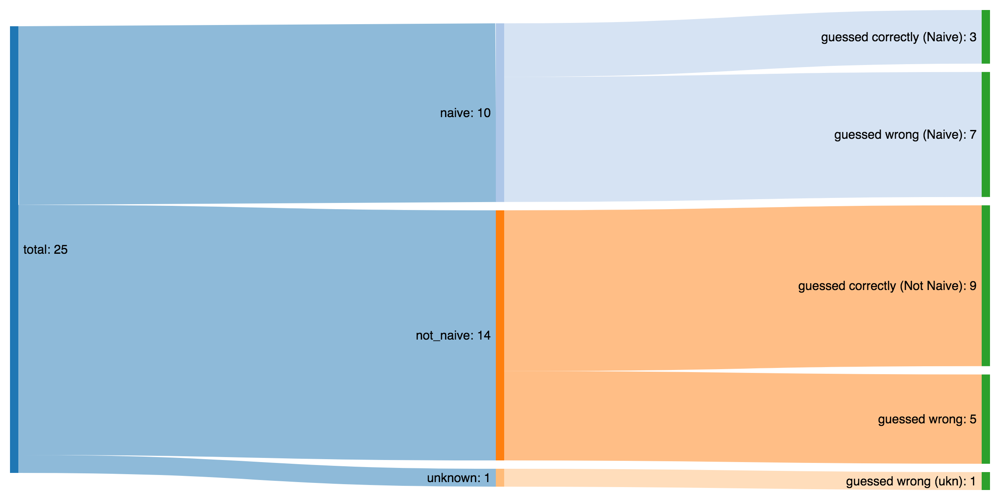

# INDEX

## Summary

In order to get practical experience with data collection and analysis, we conducted a turrón tasting experiment with the collaboration of EMBO staff. We asked 24 participants to taste 2 turrón varieties, one that was expensive and one that was cheap. Participants were blind as to which variety was which. We asked participants to (i) score each turrón in several parameters and (ii) guess which of 2 varieties was the expensive one.

Data collected in this experiment show no significant difference in scoring for the cheap vs. expensive turrón. We also observed a 50-50 percentage of guesses that A (or B) was the expensive turrón. We could not detect any significant correlation between fasting time and turrón scoring, nor did we observe significant interactions between gender and scoring or gender and accuracy of guess. We did observe that participants that had already tasted turrón before were better at guessing which of the 2 was the more expensive variant.

The experiment was limited in sample size, so no solid conclusions can be driven. However, data collected in this experiment suggest that an expensive and a cheap turrón cannot be distinguished in a blind tasting.

## Introduction

TODO:
* infographic with experimental design
* pictures of turron boxes

Altough EMBO is a scientific organisation, not all staff comes from a scientific background. We did this experiment as part of a **learning exercise to get acquainted with concepts like experimental design, data collection, data analysis and reporting**. We were convinced that forcing ourselves to do as realistic an experiment as possible would give us the biggest learning outcome.

Since we had 2 turrón varieties of the same kind but of very different prices at hand, we reasoned that it would be a 'fun' experiment to **have EMBO staff try to differentiate those 2 varieties from each other simply by a series of parameters, including taste, texture, and visual appearance**.

Turrón variety #1 ('expensive_turrón' or 'turrón_A') cost 5x as much as turrón variety #2 ('cheap_turrón' or 'turrón_B'). We designed a simple experiment in which volunteers would taste both turrón varieties and then be asked to fill in a questionnaire. They scored both turrones on parameters 'texture', 'visual appearace', 'taste', 'sweetness' and 'overall score'. Our aim with these questions was to collect information that would help us evaluate whether subjects had a preference for turrón A or turrón B.

In addition to turrón-related parameters, we also asked participants to answer the following questions:

* Which of the 2 turrones do you think is the expensive one? - This question would allow us to analyse guess accuracy and coherence between turrón scoring and guess. It was also a great motivator to engage participants, as they were presented with a challenge.
* Was this the first time you tasted turrón? - This would allow us to separate groups into naive vs. non-naive participants and evauate whether previous experience had any effect on turrón scoring or on the accuracy of the guess.
* How many hours ago did you last eat? - This question would allow us to analyse a possible correlation between fasting time and turrón scoring or accuracy of guess.

We also noted the gender of each participant on their questionnaire to analyse any possible gender:scoring or gender:accuracy interactions.

We observed only **minor differences in scoring for visual, texture, sweetness and taste parameters between both turrón varieties despite the price difference**. In general the range of scoring was very similar between both turrón varieties, with very few low or high scores. Female participants tended to score higher for both turrones in visual and texture parameters.

Interestingly, **participants that had already tasted turrón before** (i.e. they were non-naive) **had a higher success rate in guessing the expensive turrón**. They also scored turrón_A higher than turrón_B in several parameters.

All in all, it was a useful experiment to learn the basics of experimental design, data collection, analysis and representation. Our sample size was too small to draw any solid conclusions but our observations suggest that **a random sample of people would not be able to distinguish the expensive from the cheap turrón in a blind tasting**.

<!-- So, in conclusion: you do not need to spend the money on an expensive turrón, the cheap one will do just as well...  -->


<!-- * Why did we do this?
* Motivation
 -->

## Limitations

* number of subjects
* lack of independance
* material shortage
* time constraint / personal circumstances
* some questions not well formulated (e.g. sweetness)
* expectations
    * small group
    * score very similar in between turróns

## Experimental design and procedure


The aim of the experiment was to **test whether a large price difference in turrón would manifest in a significant difference in scoring and overall liking in a blind tasting**.

We designed the experiment such that **each participant would taste both turrones**. We predefined a time frame of 1h in which participants would taste. We portioned each turrón into approximately 1cm3 pieces on 2 identical plates and located them in neighboring but separate rooms. We advised participants that they should score both turrones independently (to the extent possible). Participants were naive in what they were going to be asked about. As they arrived, we told them that there were 2 turrón varieties, one cheap, one expensive. We asked them to taste both and then score them  by filling in the questionnaire below. We also asked them to guess which one of the 2 turrones they thought was the expensive one.

We noticed that the question about sweetness was ambiguous. Some participants scored how much they liked the sweetness of the turron, while others scored how sweet it tasted. Since the aim of the question was not unanimous we decided to exclude sweetness from the analysis.

* logic for data collection
* questions

## Statistical analysis

* Describe each of the analyses performed and the choice of test for each
* Table with final n number (after NA removal) for each analysis
* Missing data (and how to handle)

###  Data collection


## Results

* turrón A vs B
* gender general effect
* turrón:gender
* turrón:first_time_tasting
* coherence analysis
* correlation with fasting
* [for presentation only?] results of individual guessing accuracy

### turron_A vs turron_B
First we look at the scores that both _turrones_ received accross the different categories.
Although turron_A (the expensinve one) was consistently scored higher (except in _visual_) the difference is neglectable.


### Gender general effect
When looking at both _turrones_ at the same time we don't find significant differences between genders, with the exception of texture and visual. Females tend to give a higher score.




### Turron by gender
If we now look at the gender effect on each of the different _turrones_ we find:

* the patterns we found before appear again when looking at each _turron_ individually
* both male and female gave higher score to turron_A




Additionally we calculated the following p-values by using a paired t-test:

```
P Value gender: male;	flavour_A vs flavour_B	= 0.9266 / delta mean 0.1667
P Value gender: female;	flavour_A vs flavour_B	= 0.3556 / delta mean 0.5294
P Value gender: male;	visual_A  vs visual_B	= 0.8831 / delta mean 0.1667
P Value gender: female;	visual_A  vs visual_B	= 0.9144 / delta mean -0.0588
P Value gender: male;	texture_A vs texture_B	= 0.6952 / delta mean 0.6667
P Value gender: female;	texture_A vs texture_B	= 0.4293 / delta mean 0.4118
P Value gender: male;	overall_A vs overall_B	= 0.7827 / delta mean 0.3333
P Value gender: female;	overall_A vs overall_B	= 0.8990 / delta mean 0.0714
```

### Guess rate analysis
TODO:
* grafica donde se vea el overall guess rate ~ 50-50

Data indicates participants couldn't correctly guess which turron was the expensive one.


### Influence of previous tasting experience on scoring
If we divide our sample in between:

* naive: those who were tasting turron for the very first time in their lives
* not naive: and those who had tasted turron in the past

we can see that the not-naive group was systematically rated better the more expensive turron (A) accross all categories



We also observe that they proved to be better at guessing which turron was the epensive one, 64% of them guessed correctly. In contrast, in the naive group, only 30% was guessed correctly.




### Coherence analysis

Based on the premise that we expected expensive turron to be rated higher, we define coherence as giving a higher score to the turron you think is the expensive one. We aware that this must not always be the case, but we worked with definition.

By this definition we find that:

* 75% of participants gave a higher score to the turron they though was the most expensive one
* 10% rated both turrons with the same overall score
* and 15% rated better the turron they though to be the cheap one


### Influence of fasting


## Discussion

* In context with other similar or related analysis
* Refer to the yoguhrt experiment
* Better questions (e.g. the 'sweetness' parameter invalidated because some people scored which one was sweeter and others scored which of the 2 they liked better for sweetness)
* Why not the tea lady tasting

In these categories male score was bordered (on average) the 5.


## Conclusions

* There is no big difference in liking or general scoring between cheap and expensive turrón
* most people at EMBO have breakfast bw 7-9am
* There is no effect of fasting on turrón scoring
* The sweetness question was too ambiguous
* Non-naive tasters tended to be better at guessing which was the expensive variant
* Female participants tended to generally score better for texture and visual
* Most participants were coherent in their scoring-guessing
* some people cannot process information on our ballots


## Q&A

**Why did you do this?**
We wanted to play around with data collection and analysis concepts and we thought conducting a real experiment would be fun and practical.

**¿Why did you use turrón?**
This was just by chance. Alex happened to have brought back 2 very differently priced varieties of the same kind of turrón from Spain so we went with that.

**Why did you ask so many questions?**
We wanted to collect as much data as possible in one go, so we asked about different aspects that have to do with taste and liking of turrón.

**What's the main result?**
That there is no difference in scoring between an expensive and a cheap turrón in a random sample of 24 participants that tasted blindly

**How many people got it right?**
50%

**This is not really a serious experiment. Your sample size is too small. Your analysis is flawed. You did not formulate the right hypothesis [insert any other nasty (but probably true) statements here]**
We know :-) We just wanted to play around with data collection and analysis concepts, this is just for demonstration purposes. Also, you were all wanting to know if you guessed correctly which one of the 2 turrones was the expensive one :-D

**Can I see the data?**
Yep! It's all right [here](linkToDataOnGitHub)


