# The Turron Experiment
By [Eva Benito Garagorri](https://github.com/evilla-19) and [Alejandro Riera Mainar](http://github.com/ariera/) published 2019-06-06.
## Summary

In order to get practical experience with data collection and analysis, we conducted a turrón tasting experiment with the collaboration of EMBO staff. We asked 24 participants to taste 2 turrón varieties, one that was expensive and one that was cheap. Participants were blind as to which variety was which. We asked participants to (i) score each turrón in several parameters and (ii) guess which of 2 varieties was the expensive one.

Data collected in this experiment show no significant difference in scoring for the cheap vs. expensive turrón. We also observed a 50-50 percentage of guesses that A (or B) was the expensive turrón. We could not detect any significant correlation between fasting time and turrón scoring, nor did we observe significant interactions between gender and scoring or gender and accuracy of guess. We did observe that participants that had already tasted turrón before were better at guessing which of the 2 was the more expensive variant.

The experiment was limited in sample size, so no solid conclusions can be driven. However, data collected in this experiment suggest that an expensive and a cheap turrón cannot be distinguished in a blind tasting.

## Introduction

Altough EMBO is a scientific organisation, not all staff comes from a scientific background. We did this experiment as part of a **learning exercise to get acquainted with concepts like experimental design, data collection, data analysis and reporting**. We were convinced that forcing ourselves to do as realistic an experiment as possible would give us the biggest learning outcome.

Since we had 2 turrón varieties of the same kind but of very different prices at hand, we reasoned that it would be a 'fun' experiment to **have EMBO staff try to differentiate those 2 varieties from each other simply by a series of parameters, including taste, texture, and visual appearance**.

Turrón variety #1 ('expensive_turrón' or 'turrón_A') cost 5x as much as turrón variety #2 ('cheap_turrón' or 'turrón_B'). We designed a simple experiment in which volunteers would taste both turrón varieties and then be asked to fill in a questionnaire. They scored both turrones on parameters 'texture', 'visual appearace', 'taste', 'sweetness' and 'overall score'. Our aim with these questions was to collect information that would help us evaluate whether subjects had a preference for turrón A or turrón B.

| 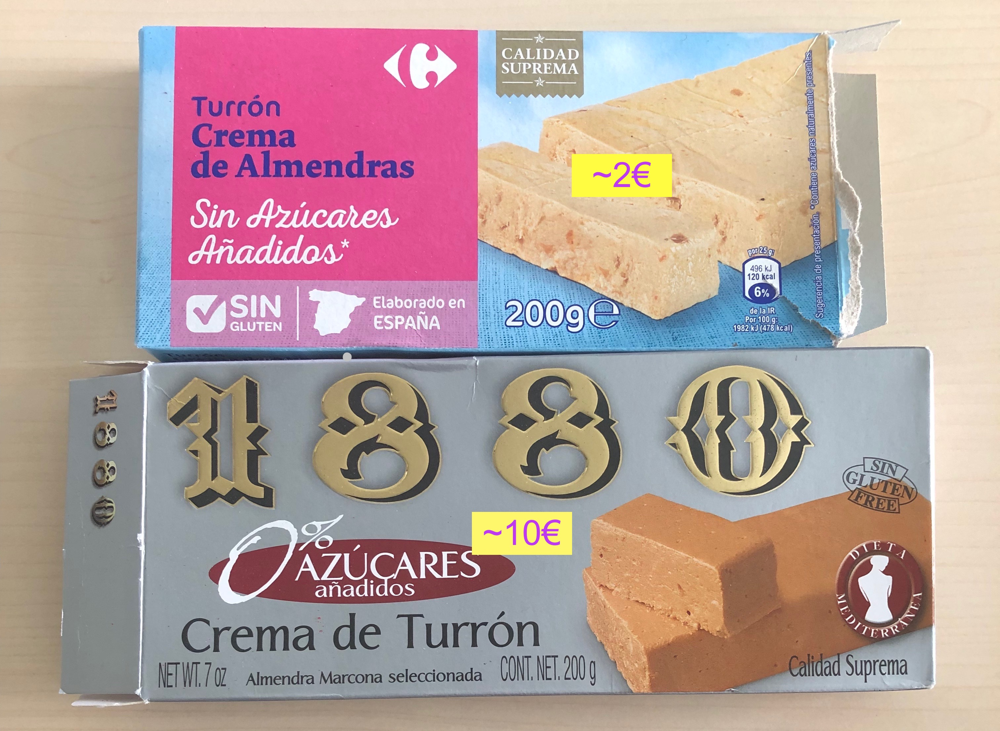 |
|:--:|
| <small>*Image depicting the original packaging for both turrones and their approximate prices.*</small> |

In addition to turrón-related parameters, we also asked participants to answer the following questions:

* Which of the 2 turrones do you think is the expensive one? - This question would allow us to analyse guess accuracy and coherence between turrón scoring and guess. It was also a great motivator to engage participants, as they were presented with a challenge.
* Was this the first time you tasted turrón? - This would allow us to separate groups into naive vs. non-naive participants and evauate whether previous experience had any effect on turrón scoring or on the accuracy of the guess.
* How many hours ago did you last eat? - This question would allow us to analyse a possible correlation between fasting time and turrón scoring or accuracy of guess.

We also noted the gender of each participant on their questionnaire to analyse any possible gender:scoring or gender:accuracy interactions.

| 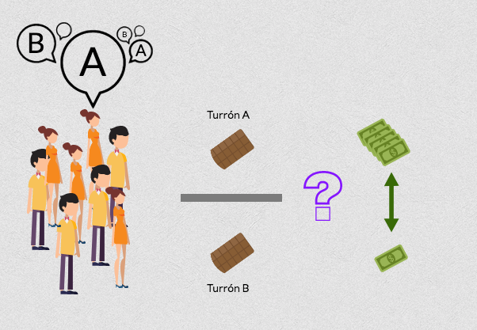 |
|:--:|
| <small>*Experimental design. Participants were asked to blindly taste 2 differently priced variants of turrón. They were given the information that one turrón was significantly more expensive than the other one and then asked to fill out a questionnaire to rate each of the turrones by sweetness, texture, and visual parameters. They were also asked to have a guess at which of the 2 turrones was the expensive one.* </small>|


We observed only **minor differences in scoring for visual, texture, sweetness and taste parameters between both turrón varieties despite the price difference**. In general the range of scoring was very similar between both turrón varieties, with very few low or high scores. Female participants tended to score higher for both turrones in visual and texture parameters.

Interestingly, **participants that had already tasted turrón before** (i.e. they were non-naive) **had a higher success rate in guessing the expensive turrón**. They also scored turrón_A higher than turrón_B in several parameters.

All in all, it was a useful experiment to learn the basics of experimental design, data collection, analysis and representation. Our sample size was too small to draw any solid conclusions but our observations suggest that **a random sample of people would not be able to distinguish the expensive from the cheap turrón in a blind tasting**.

<!-- So, in conclusion: you do not need to spend the money on an expensive turrón, the cheap one will do just as well...  -->


<!-- * Why did we do this?
* Motivation
 -->

## Limitations

We are aware that there are several limitations in our experiment and that all of the analyses and observations described in this report have to be taken with caution.

More specifically, we are aware of the following limitations:

* The number of subjects was too low to draw solid conclusions on guess accuracy. Although there is a strong trend towards non-naive tasters to perform better in distinguishind the expensive and cheap turron, we know that this could be due to a skewed sample of limited size. Similarly, and although we were not expecting huge variations in the scoring range in such a tasting experiment, we believe that our sample size was in any case too small to detect potentially interesting differences in scoring parameters.
* Tasting wat not independent for both groups, i.e. we had participants taste both turrones within a limited time frame. An alternative design to compare turrón A and B might have been to split participants and have half taste one turrón and half taste the other. We decided to have all participants taste both to keep their interest up and to make it a challenge to try to guess which one the expensive one was.
* Our starting material amounts of both turrones was rather small in size. This prevented us from conducting a more complex tasting experiment, such as presenting each candidate with several pieces of each of the turrones and asking them to have a guess for each of the pieces.
* Time restrains: since we asked participants to voluntarily participate in the tasting experiment, we did not want to design a complicated experiment that would take up a lot of their time. An experiment like the one formulated above with multiple tasting could have been more informative but would have defied the objective to make it short and doable for participants.
* Although we designed our questions in advance and tried to formulate them in the most clear way possible, we still encountered some instances in which the purpose of the question was not clear to participants. Such is the case of the question about "sweetness", in which participants were unclear whether we were asking them to rate sweetness level, or whether we were asking them to give the parameter sweetness a subjective score.
* In a tasting like this, we did not expect major differences in scoring of both turrones, simply because people tend to score around the median value and they are very unlikely to score very high or low unless one of the turrones would have been really untasty. So we were aware that detecting differences in scoring between both turrones was very unlikely in this scenario.

## Experimental design and procedure


The aim of the experiment was to **test whether a large price difference in turrón would manifest in a significant difference in scoring and overall liking in a blind tasting**.

We designed the experiment such that **each participant would taste both turrones**. We predefined a time frame of 1h in which participants would taste. We portioned each turrón into approximately 1cm3 pieces on 2 identical plates and located them in neighboring but separate rooms. We advised participants that they should score both turrones independently (to the extent possible). Participants were naive in what they were going to be asked about. As they arrived, we told them that there were 2 turrón varieties, one cheap, one expensive. We asked them to taste both and then score them  by filling in the questionnaire below. We also asked them to guess which one of the 2 turrones they thought was the expensive one.

###  Data collection

Data was collected using questionnaires that participants filled out right after tasting both turrones. The image below shows an example of a questionnaire:

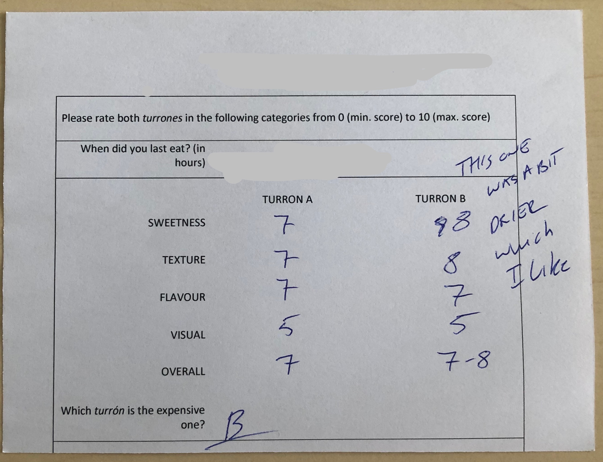

We noticed that the question about sweetness was ambiguous. Some participants scored how much they liked the sweetness of the turron, while others scored how sweet it tasted. Since the aim of the question was not unanimous we decided to exclude sweetness from the analysis.


## Statistical analysis

### Statistical analysis

Our logic for statistical analysis was as follows:

- For the gender general effect, we used an independent t-test for each parameter, as individuals compared (male vs. female) were not the same.
- For the turron by gender effect, we used a 2-WAY ANOVA for each parameter, so that we could evaluate the main effect of gender, that of the turron and the interaction. We then carried out individual paired t-tests for each comparison between turrones within a given gender. We chose a paired t-test in this case because the individuals being compared across groups were the same.
- For turron general scoring differences we used a paired t-test, as it was the same individuals tasting both turrones in each group.
- For the turron by first-time-tasting interaction effect, we used a 2-WAY ANOVA to test for general effect of naiveness, general effect of turron and their interaction. We then used a paired t-test to compare within naive/non-naive groups, as in this case it was also the same individuals across compared groups.
- For the effect of naiveness (having tasted turron before or not) on guess accuracy we used a Fischer's test.
- For the correlation of hours-since-last-eat and turron scoring, we used a Pearson's correlation test.

### Missing data

Some participants did not fully fill out the questionnaire and others answered some questions with non-numerical scores. We considered those instances 'missing data' and simply excluded them from each analysis as appropriate. We did not systematically invalidate a participant if they had one parameter with missing data but rather removed only missing values from each separate analysis (i.e. if a participant did not give an 'overall score' but still gave a 'texture score', we only excluded the overall score). This explains why we have different N numbers for each analysis, as detailed in the table below:


## Results


### Descriptive statistics

The charts below show the general distribution of participants in terms of gender, naiveness (whether or not it was the first time they tasted turron) and fasting time before the tasting:

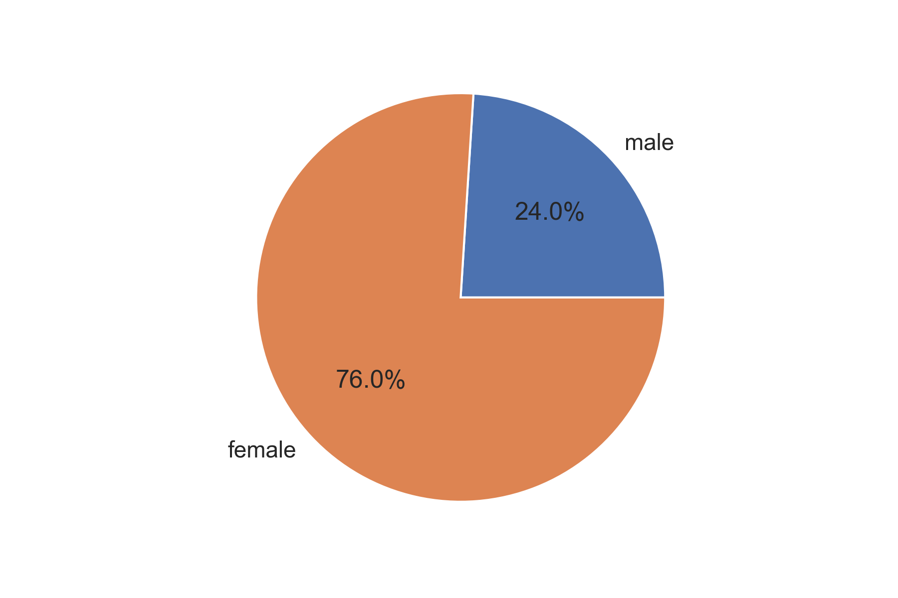
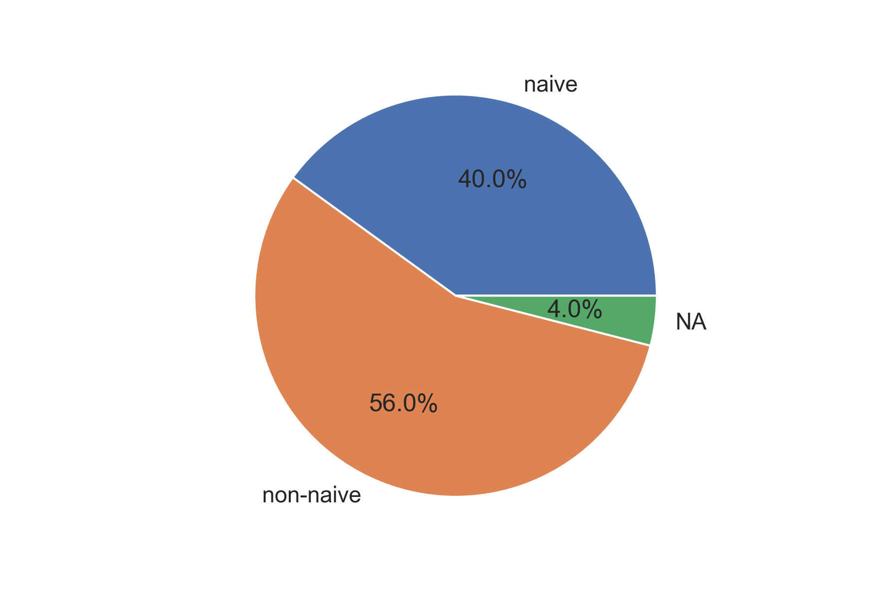
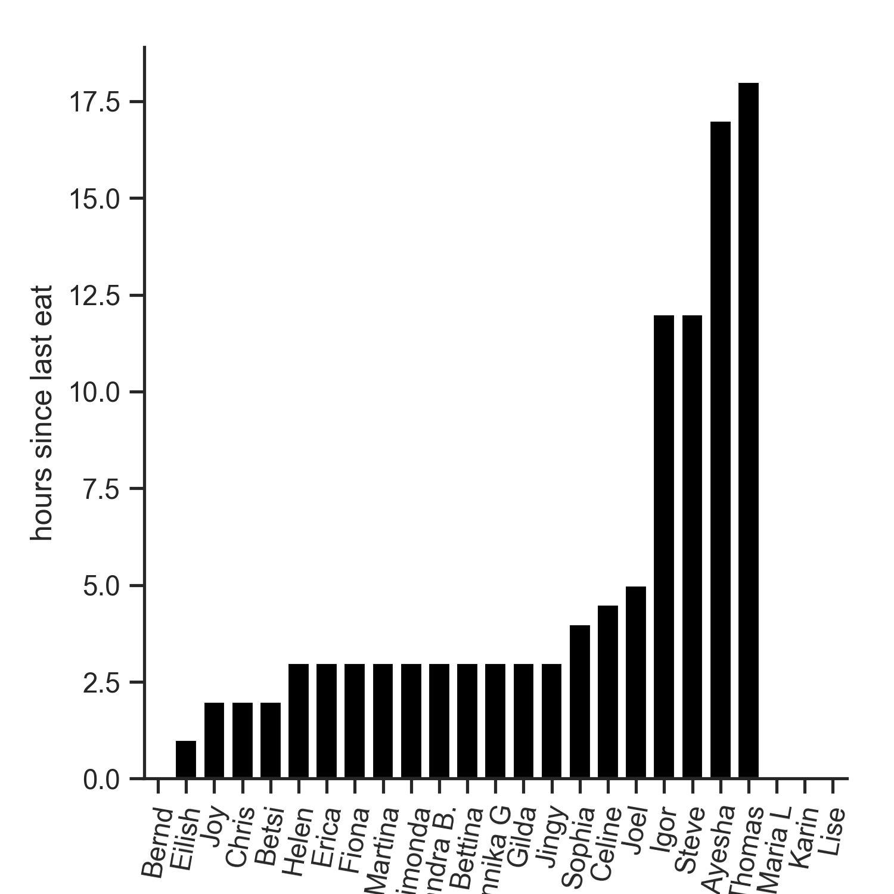


### turron_A vs turron_B
First we look at the scores that both _turrones_ received accross the different categories.
Although turron_A (the expensinve one) was consistently scored higher (except in _visual_) the difference is neglectable.

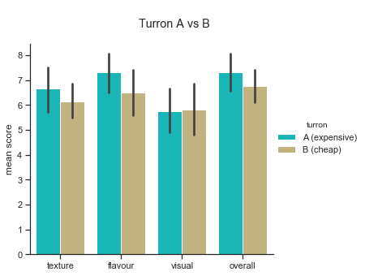

### Gender general effect
When looking at both _turrones_ at the same time we don't find significant differences between genders, with the exception of texture and visual. Females tend to give a higher score.


### Turron by gender
If we now look at the gender effect on each of the different _turrones_ we find:

* the patterns we found before appear again when looking at each _turron_ individually
* both male and female gave higher score to turron_A


Additionally we calculated the following p-values by using a paired t-test:

```
P Value gender: male;	flavour_A vs flavour_B	= 0.9266 / delta mean 0.1667
P Value gender: female;	flavour_A vs flavour_B	= 0.3556 / delta mean 0.5294
P Value gender: male;	visual_A  vs visual_B	= 0.8831 / delta mean 0.1667
P Value gender: female;	visual_A  vs visual_B	= 0.9144 / delta mean -0.0588
P Value gender: male;	texture_A vs texture_B	= 0.6952 / delta mean 0.6667
P Value gender: female;	texture_A vs texture_B	= 0.4293 / delta mean 0.4118
P Value gender: male;	overall_A vs overall_B	= 0.7827 / delta mean 0.3333
P Value gender: female;	overall_A vs overall_B	= 0.8990 / delta mean 0.0714
```

### Guess rate analysis

Data indicates participants couldn't correctly guess which turron was the expensive one.

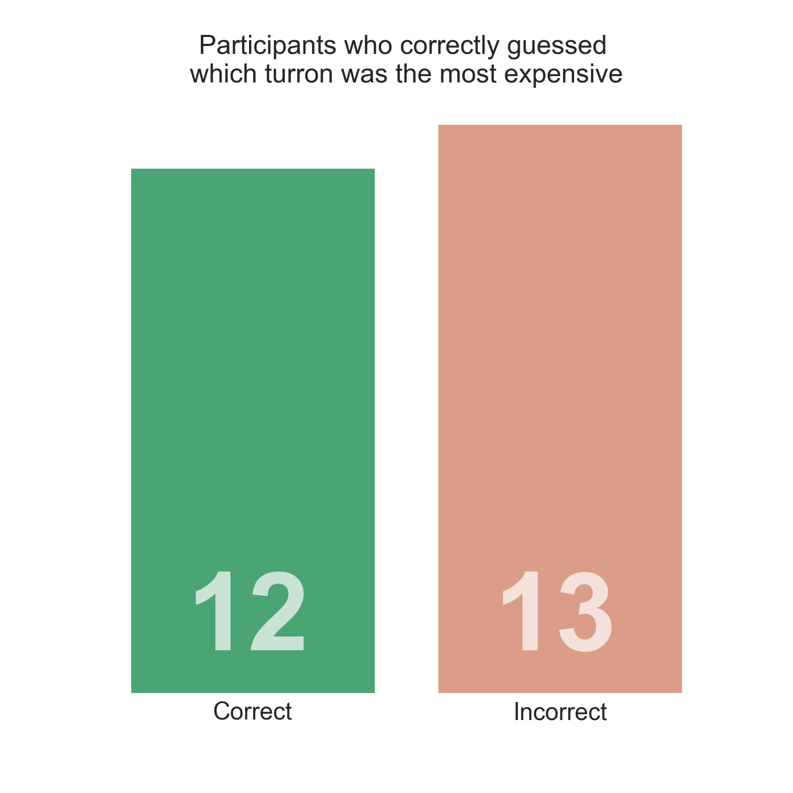

### Influence of previous tasting experience on scoring
If we divide our sample in between:

* naive: those who were tasting turron for the very first time in their lives
* not naive: and those who had tasted turron in the past

we can see that the not-naive group was systematically rated better the more expensive turron (A) accross all categories


We also observe that they proved to be better at guessing which turron was the epensive one, 64% of them guessed correctly. In contrast, in the naive group, only 30% was guessed correctly.

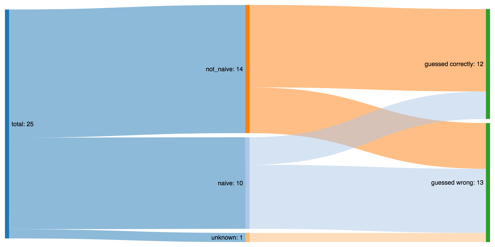


Just as an aside, we also plotted the success rate by gender, with a slight trend towards females having a better guessing score. This distribution reflect the general gender imbalance in the participants' pool, so it is far from being significant:

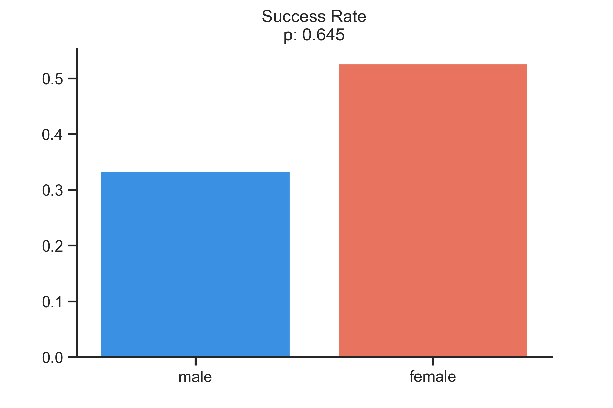


### Coherence analysis

Based on the premise that we expected expensive turron to be rated higher, we define coherence as giving a higher score to the turron you think is the expensive one. We aware that this must not always be the case, but we worked with definition.

By this definition we find that:

* 75% of participants gave a higher score to the turron they though was the most expensive one
* 10% rated both turrons with the same overall score
* and 15% rated better the turron they though to be the cheap one


### Influence of fasting

We hypothesized that the time since the last meal might have a positive effect on the scoring of turron, i.e., that people who are more hungry might score the turron higher. Our result show in fact the opposite trend for all parameters, reaching significance for visual and nearly for flavour when analyzing both turrones together. When splitting both turrones, the trend appears to be stronger for turron A.

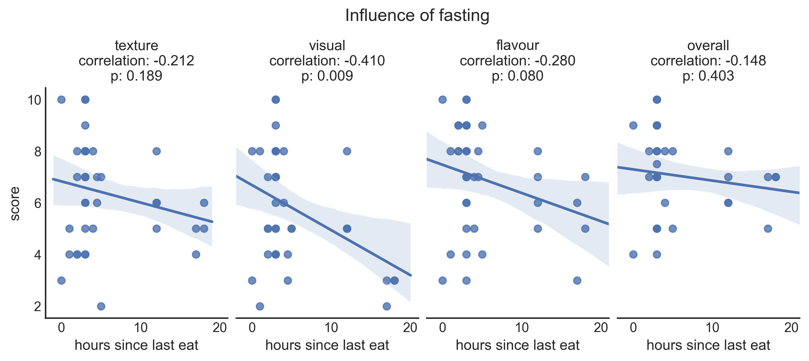


## Discussion

* In context with other similar or related analysis
* Refer to the yoguhrt experiment
* Better questions (e.g. the 'sweetness' parameter invalidated because some people scored which one was sweeter and others scored which of the 2 they liked better for sweetness)
* Why not the tea lady tasting

In these categories male score was bordered (on average) the 5.


## Conclusions

* There is no big difference in liking or general scoring between cheap and expensive turrón
* We found a negative correlation between fasting time and scoring, reaching significance in visual appeal
* The sweetness question was too ambiguous
* Non-naive tasters tended to be better at guessing which was the expensive variant
* Female participants tended to generally score better for texture and visual
* Most participants were coherent in their scoring-guessing
* Most people at EMBO have breakfast bw 7-9am
* Some people could not process information on our ballots

